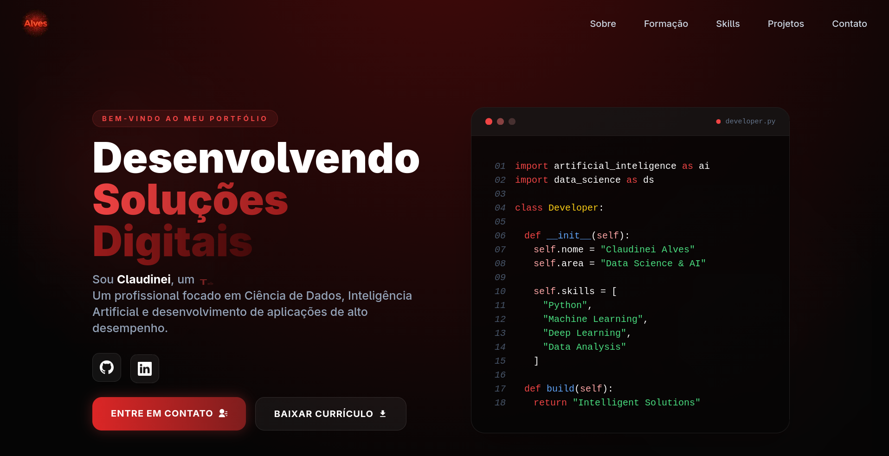

# 🌐 Claudinei Alves — Personal Portfolio

Bem-vindo ao meu portfólio pessoal de desenvolvedor, criado para apresentar meus projetos, habilidades e trajetória na área de tecnologia, ciência de dados e desenvolvimento de software.

Este site foi desenvolvido utilizando tecnologias modernas de desenvolvimento web, com foco em performance, design responsivo e experiência do usuário.

---
## Screenshot


---
## Live Demo

🔗 [Visit Portfolio Website]()

---

##  Tecnologias Utilizadas
- ⚡ **Framework**: [Next.js 15](https://nextjs.org/)
- 🎨 **Styling**: [Tailwind CSS 3](https://tailwindcss.com/)
- 💻 **TypeScript**: Fully typed components & utilities
- 🧩 **Animations**: [Lottie React](https://www.npmjs.com/package/lottie-react)
- 📧 **Contact**: [EmailJS](https://www.emailjs.com/) integration
- 📦 **PWA Ready**: Uses [`@ducanh2912/next-pwa`](https://www.npmjs.com/package/@ducanh2912/next-pwa)
- 🔐 **reCAPTCHA v3**: [Google reCAPTCHA](https://www.npmjs.com/package/react-google-recaptcha)
- 🧠 **Icons**: [Lucide](https://lucide.dev/), [React Icons](https://react-icons.github.io/)
- ✅ **Prettier + ESLint**: Enforced code style & formatting
- 🧪 **Husky**: Git hooks for pre-commit checks

---
## Funcionalidades
- 📱 Design totalmente responsivo
- 🎨 Interface moderna e animada
- 🧑‍💻 Seção de projetos com descrição e tecnologias
- 🛠️ Exibição de habilidades técnicas
- 🎓 Histórico educacional
- 📧 Formulário de contato funcional
- 🌙 UI otimizada para experiência do usuário
---

## 🛠️ Getting Started

### 1. Clone this repo

```bash
git clone https://github.com/your-username/your-portfolio.git
cd your-portfolio
```

### 2. Install dependencies

```bash
pnpm install
# or
npm install
# or
yarn install
```

### 3. Run the development server

```bash
pnpm dev
# or
npm run dev
```

Then visit: [http://localhost:3000](http://localhost:3000)

---

## 🧪 Environment Variables

Copy `.env.example` and create `.env.local`:

```env
NEXT_PUBLIC_EMAILJS_SERVICE_ID=
NEXT_PUBLIC_EMAILJS_TEMPLATE_ID=
NEXT_PUBLIC_EMAILJS_PUBLIC_KEY=
```

---

## 📦 Deployment

deployed  [here]()

---

## 📄 License

This project is open-source and available under the [MIT License](LICENSE).

---

## 📬 Autor

### Claudinei Alves
- 💼 Desenvolvedor & Cientista de Dados em formação
- 🎓 Estudante de tecnologia e inteligência artificial
- 🌎 Brasil

## 📫 Entre em contato:
LinkedIn: [here](https://www.linkedin.com/in/claudinei-alves-reis/)
GitHub: [here](https://github.com/ClaudineiAlves)
Email: [alvesreis.dev@gmail.com](mailto:alvesreis.dev@gmail.com)  

```
